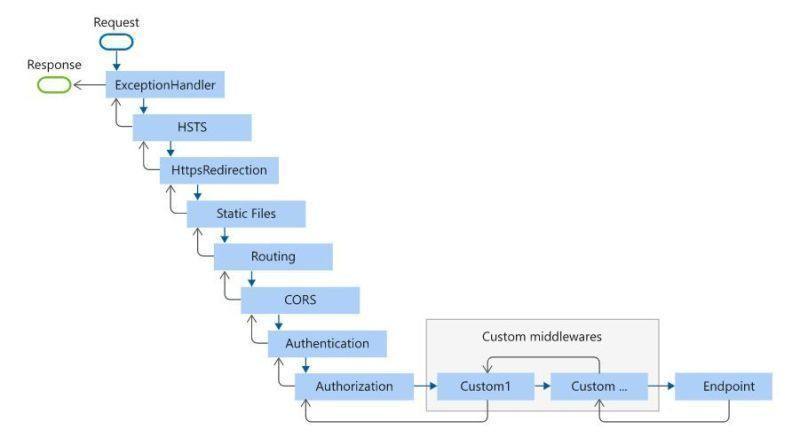

# Middleware Flow Order Demo

A demonstration of Express.js middleware flow order based on best practices shared by [Adnan Maqbool Khan](https://www.linkedin.com/posts/adnan-maqbool-khan-0b4531a1_%F0%9D%90%96%F0%9D%90%A1%F0%9D%90%9A%F0%9D%90%AD-%F0%9D%90%AC%F0%9D%90%A1%F0%9D%90%A8%F0%9D%90%AE%F0%9D%90%A5%F0%9D%90%9D-%F0%9D%90%9B%F0%9D%90%9E-%F0%9D%90%AD%F0%9D%90%A1%F0%9D%90%9E-%F0%9D%90%A8%F0%9D%90%AB%F0%9D%90%9D%F0%9D%90%9E%F0%9D%90%AB-activity-7276151815925043200-plX5).

## Architecture



## Features

- Exception handling with error propagation
- HTTPS enforcement via HSTS
- Automatic HTTPS redirection
- Static file serving
- Custom routing logic
- CORS protection with origin validation
- Token-based authentication
- Role-based authorization
- Console logging of middleware flow

## Installation

```bash
git clone <repository-url>
cd middleware-flow-order
npm install
```

## Usage

Start the server:

```bash
npm start
```

## Test Scenarios

### 1. Successful Request

```bash
curl -H "Authorization: Bearer valid-token" http://localhost:3000/
```

Expected Output:

```
⏳ Entering Exception Handler Middleware
⏳ Entering HSTS Middleware
⏳ Entering HTTPS Redirection Middleware
...
✅ User authorized
🎯 Reached endpoint handler
```

### 2. CORS Attack

```bash
curl -H "Origin: http://malicious-site.com" \
     -H "Authorization: Bearer valid-token" \
     http://localhost:3000/
```

Expected Output:

```
⏳ Entering CORS Middleware
🚫 Blocked request from unauthorized origin: http://malicious-site.com
```

### 3. Authentication Attack

```bash
curl -H "Authorization: Bearer invalid-token" http://localhost:3000/
```

Expected Output:

```
⏳ Entering Authentication Middleware
🚫 Invalid token: Bearer invalid-token
```

### 4. Authorization Attack

```bash
curl -H "Authorization: Bearer valid-token" \
     "http://localhost:3000/?requiredRole=admin"
```

Expected Output:

```
⏳ Entering Authorization Middleware
🚫 Insufficient permissions
```

## Sample Output

```
🚀 Server running on port 3000
⏳ Entering Exception Handler Middleware
⏳ Entering HSTS Middleware
📝 Set HSTS header with max-age: 31536000
⏳ Entering HTTPS Redirection Middleware
⏳ Entering Static Files Middleware
⏳ Entering Routing Middleware
🛣️ Route: GET /
⏳ Entering CORS Middleware
✅ Allowed CORS for origin: http://localhost:3000
⏳ Entering Authentication Middleware
👤 Authenticated user: { id: 1, role: 'user' }
⏳ Entering Authorization Middleware
✅ User authorized
🎯 Reached endpoint handler
```

## Credits

Special thanks to [Adnan Maqbool Khan](https://www.linkedin.com/in/adnan-maqbool-khan-0b4531a1/) for sharing the middleware order best practices that inspired this implementation.

## License

MIT
